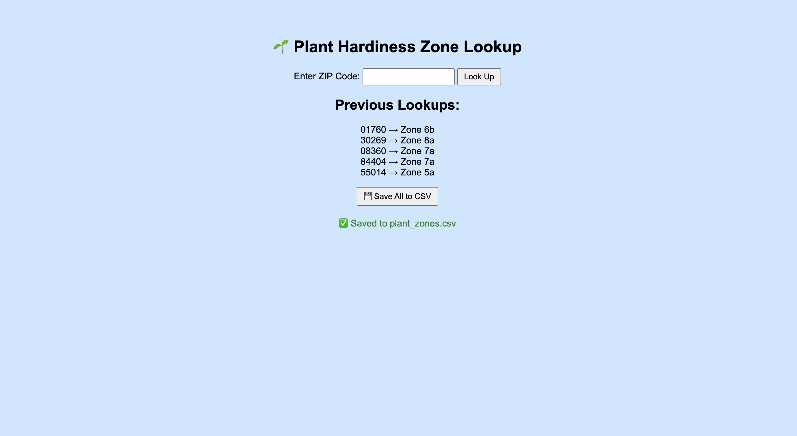

# Plant Hardiness Zone Lookup App  
This is a simple Flask web app that lets users look up U.S. plant hardiness zones by ZIP code using the Plant Hardiness Zone API. It supports multiple lookups and lets you save the results to a CSV file.  



## Features  
- Enter any U.S. ZIP code to get its plant hardiness zone  
- View a list of previous lookups  
- Save all results to a CSV file with one click  

## How to Run Locally  
1. **Clone or download** this repo  
2. **Navigate to the folder**:  
```bash
cd plant-zone-app
```  
3. **Install dependencies**:  
```bash
pip install flask requests
```  
4. **Add your API key**  
   In `app.py`, replace:  
```python
"X-RapidAPI-Key": "YOUR_API_KEY_HERE"
```  
with your real API key from [RapidAPI](https://rapidapi.com/).  

5. **Run the app**:  
```bash
python3 app.py
```  

6. Open your browser to:  
[http://127.0.0.1:5000](http://127.0.0.1:5000)

## API Key Info  
This app uses the Plant Hardiness Zone API via RapidAPI. You'll need to:  
- Sign up at [rapidapi.com](https://rapidapi.com/)  
- Subscribe to the **Plant Hardiness Zone API**  
- Get your API key and paste it into `app.py`  

